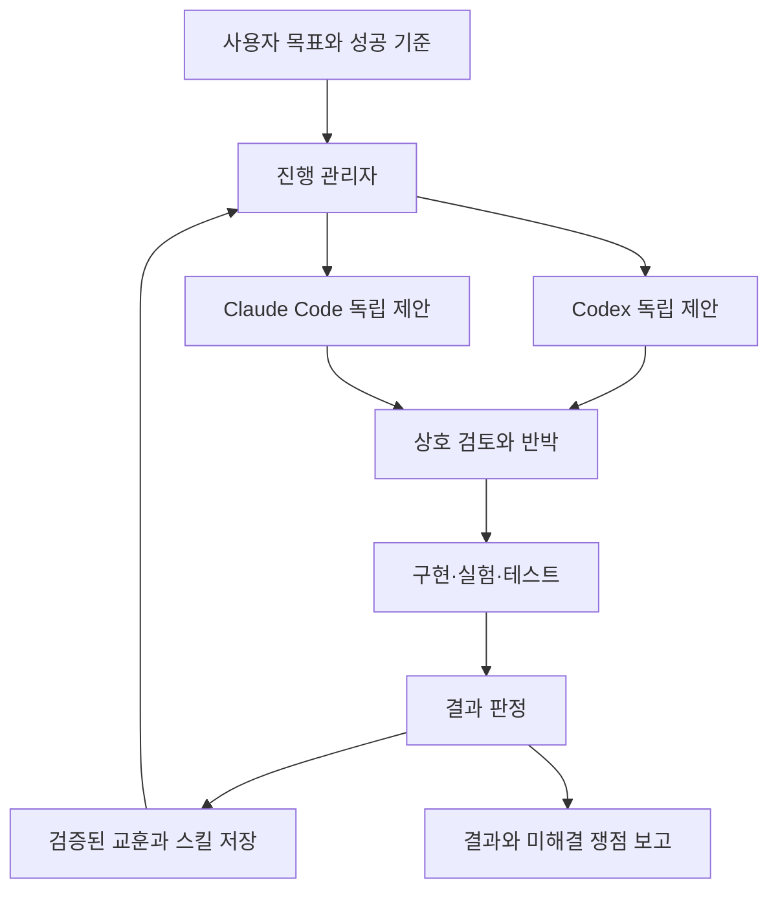

자기소개서(통칭: 자소서)를 한창 써야하는 지금이지만, 자소서를 쓰기도 슬슬 귀찮다. 그런 김에 Codex와 Claude Code를 활용한 면접 자료 및 질문 생성기를 만들기로 결심했다.
먼저 나는 컴맹인 관계로 해당 시스템 구축은 Gemini, Claude, GPT가 함께 진행할 예정이다.

## Codex와 Claude Code가 소통하는 시스템 구축하기

먼저 GPT를 사용해 다음 3가지 사이트의 링크를 학습시켰다. ([참고자료1](https://wikidocs.net/371092), [참고자료2](https://github.com/revfactory/harness), [참고자료3](https://github.com/SaehwanPark/meta-harness)) GPT-6 Astra Light Model에게 Command Prompt(cmd)에서 Codex와 Claude Code가 서로 토론하면서 성장하는 시스템을 구축하고 싶다고 요구했다. GPT는 아래와 같은 프로젝트를 제안했고, 지금 만들어볼 예정이다.



| 단계 | 만드는 것 | 완료되면 확인할 수 있는 것 |
|---|---|---|
| ① 환경 확인 | 두 도구를 외부에서 실행할 준비 | 각각 짧은 질문에 응답함 |
| ② 단일 호출 | 버튼이나 명령 한 번으로 한 AI 호출 | 답변이 파일로 저장됨 |
| ③ 독립 답변 | 같은 질문을 두 AI에게 전달 | 서로의 답을 보지 않은 제안 두 개 |
| ④ 상호 검토 | 답변을 서로 교환 | 동의·반대·검증 필요 사항 |
| ⑤ 진행 관리 | 오류 처리, 시간 제한, 중단·재개 | 한쪽이 실패해도 기록이 남음 |
| ⑥ 실제 검증 | 과제에 맞는 테스트 연결 | 주장과 실제 결과를 비교 |
| ⑦ 공유 기억 | 검증된 교훈 저장·검색 | 다음 작업에 관련 교훈 적용 |
| ⑧ 개선 평가 | 기억 사용 전후의 성과 비교 | 실제로 좋아졌는지 확인 |

## 1. 환경 확인

먼저 환경 확인 단계를 위해 C 드라이브 내부에 debate-sys라는 작업 파일을 만들었다. Git과 Node.js가 필요하지만, Git은 이미 있는 관계로 [Node.js](https://nodejs.org/ko/download)만 다운받았다.
```
npm.cmd install -g @openai/codex
```
```
irm https://claude.ai/install.ps1 | iex
```
위 코드들을 통해 Codex와 Claude Code를 설치하고 연결에 성공했다!!


단일 호출과 독립 답변은 다음 편에...